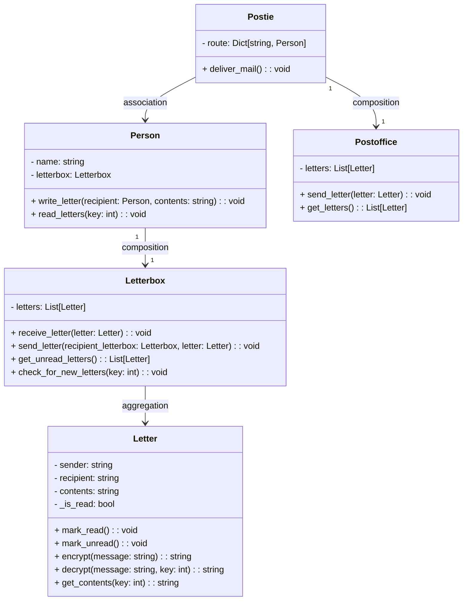

```mermaid
classDiagram
    class Letter {
        - sender: string
        - recipient: string
        - contents: string
        - _is_read: bool
        + mark_read(): void
        + mark_unread(): void
        + encrypt(message: string): string
        + decrypt(message: string, key: int): string
        + get_contents(key: int): string
    }

    class Letterbox {
        - letters: List[Letter]
        + receive_letter(letter: Letter): void
        + send_letter(recipient_letterbox: Letterbox, letter: Letter): void
        + get_unread_letters(): List[Letter]
        + check_for_new_letters(key: int): void
    }

    class Person {
        - name: string
        - letterbox: Letterbox
        + write_letter(recipient: Person, contents: string): void
        + read_letters(key: int): void
    }

    class Postie {
        - route: Dict[string, Person]
        + deliver_mail(): void
    }

    class Postoffice {
        - letters: List[Letter]
        + send_letter(letter: Letter): void
        + get_letters(): List[Letter]
    }

    Person "1" --> "1" Letterbox: composition
    Postie "1" --> "1" Postoffice: composition
    Postie --> Person: association
    Letterbox --> Letter: aggregation

```

